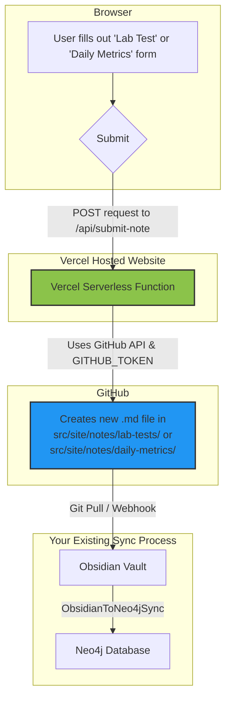

## Feature Overview

This document outlines the implementation of a new feature that allows users to submit data directly from the live Digital Garden website. This data is then saved as new markdown notes in the underlying GitHub repository, integrating seamlessly with the existing Obsidian and Neo4j synchronization pipeline.

The primary goal was to create a "headless" data entry point, enabling the capture of structured information like lab test results and daily health metrics without needing to open Obsidian.

## How It Works: The Data Flow

The entire process is designed to be robust and decoupled, using Vercel Serverless Functions and the GitHub API as a bridge between the live website and the content repository.

1.  **User Input**: A user navigates to one of the new form pages (`/lab-tests` or `/daily-metrics`) on the live website.
2.  **Frontend Submission**: The user fills out the form and clicks "Create Note". The JavaScript embedded in the page constructs a JSON payload containing the note's title, content, and target folder.
3.  **Serverless Function**: The browser sends a `POST` request to the `/api/submit-note` endpoint. This endpoint is a Vercel Serverless Function.
4.  **GitHub API Authentication**: The serverless function authenticates with the GitHub API using a `GITHUB_TOKEN` stored securely as a Vercel environment variable.
5.  **File Creation**: The function uses the GitHub API to create a new markdown file directly in the specified folder (`src/site/notes/lab-tests` or `src/site/notes/daily-metrics`) of your repository's `main` branch. The content of the note, including the frontmatter, is Base64 encoded and sent in the API request.
6.  **Downstream Sync**: Once the new note is committed to the repository, your existing Digital Garden and MKG synchronization processes take over. The new note will be pulled into your Obsidian vault and subsequently processed into your Neo4j database.

## Implemented Files

Here is a list of the files that were created or modified to build this feature:

### New Files

*   **`my-digital-garden/api/submit-note.js`**: The core of the feature. This is the Node.js serverless function that receives the form data and communicates with the GitHub API.
*   **`my-digital-garden/src/site/lab-tests.md`**: The page containing the HTML form and client-side JavaScript for submitting new lab test results.
*   **`my-digital-garden/src/site/daily-metrics.md`**: The page containing the HTML form and client-side JavaScript for submitting daily metrics.
*   **`my-digital-garden/.env`**: A file to store environment variables for local development using `vercel dev`. **This file should not be committed to version control.**

### Modified Files

*   **`my-digital-garden/package.json`**: The `@octokit/rest` library was added as a dependency. This library is a crucial helper for interacting with the GitHub API from the serverless function.

## Required Configuration

For this feature to be operational, you must configure three environment variables in your Vercel project's settings.

1.  **`GITHUB_TOKEN`**: A GitHub Personal Access Token with `repo` scope. This is the key that allows the serverless function to write to your repository.
2.  **`GITHUB_OWNER`**: Your GitHub username or the name of the organization that owns the repository.
3.  **`GITHUB_REPO`**: The name of the repository for your Digital Garden.

These variables must be set in the **Settings -> Environment Variables** section of your project on the Vercel dashboard. After setting them, you must redeploy the project for the changes to take effect.
